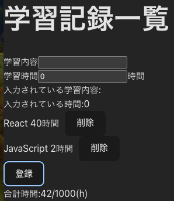

# ToDO-App

- **_概要_**
  学習内容・時間を記録し、学習のモチベーションを維持するためのツールです。
  supabase によりデータの保存を可能にしました。また、GitHubActions,Jest,ReactTestingLibrary を使用し CI/CD を可能にしました。

- **_環境設定の方法_**
  ルートディレクトリに `.env` ファイルを作成し、以下の内容を記述してください。
  （値は自身の Supabase プロジェクトから取得できます。）
  `VITE_SUPABASE_URL=YOUR_SUPABASE_URL`
  `VITE_SUPABASE_ANON_KEY=YOUR_SUPABASE_ANON_KEY`

- **_起動の仕方_**
  1,依存関係のインストール
  `npm install`
  2,ローカルサーバーの起動
  以下のコマンドを実行後、 `http://localhost:5173` にアクセスしてください。
  `npm run dev`
